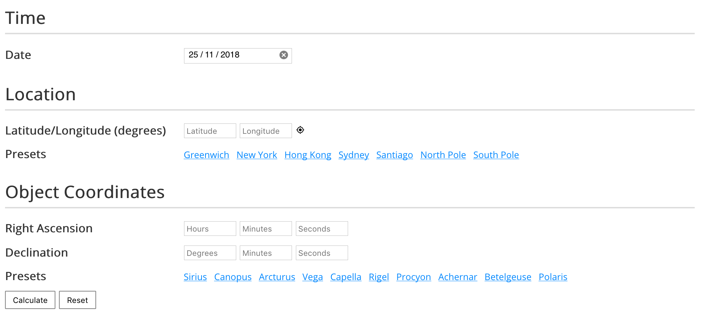

# star-rise-and-set-times

Here is a browser-based tool for calculating the rising and setting times of stars. You can [try it online here](https://codebox.net/pages/star-rise-and-set-time-calculator).

The code is based on formulae [from](https://idlastro.gsfc.nasa.gov/ftp/pro/astro/hadec2altaz.pro) [various](http://aa.usno.navy.mil/faq/docs/GAST.php) [sources](https://astronomy.stackexchange.com/a/14508/24882) with much credit to [Barry Carter](http://wordpress.barrycarter.info) for his help and patience.

This tool does not take into account atmospheric refraction, which can affect rising/setting times by several minutes - if you need that kind of accuracy then see [this page from the US Naval Observatory](https://aa.usno.navy.mil/data/docs/mrst.php). The results [have been checked](https://github.com/codebox/star-rise-and-set-times/blob/master/test/spec/calc-spec.js) against various  [other](https://aa.usno.navy.mil/data/docs/mrst.php) [online](https://www.wolframalpha.com/) [tools](https://in-the-sky.org/), written by people far more competent than me, and they broadly agree, although each tool gives slightly different answers. It is probably safe to assume accuracy to within &plusmn;10 minutes.
